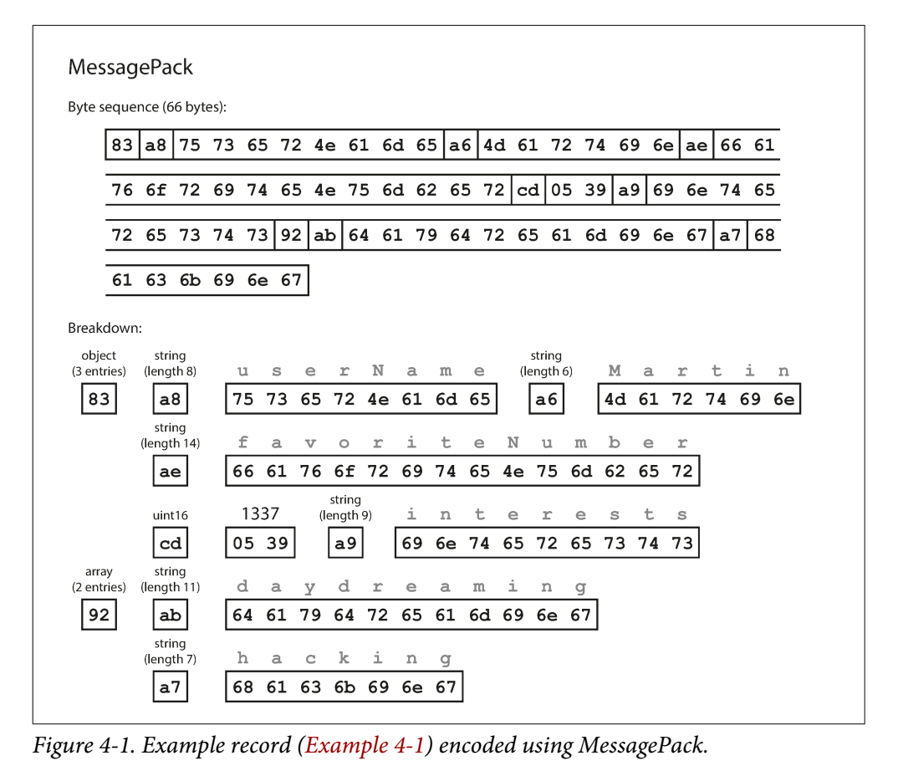
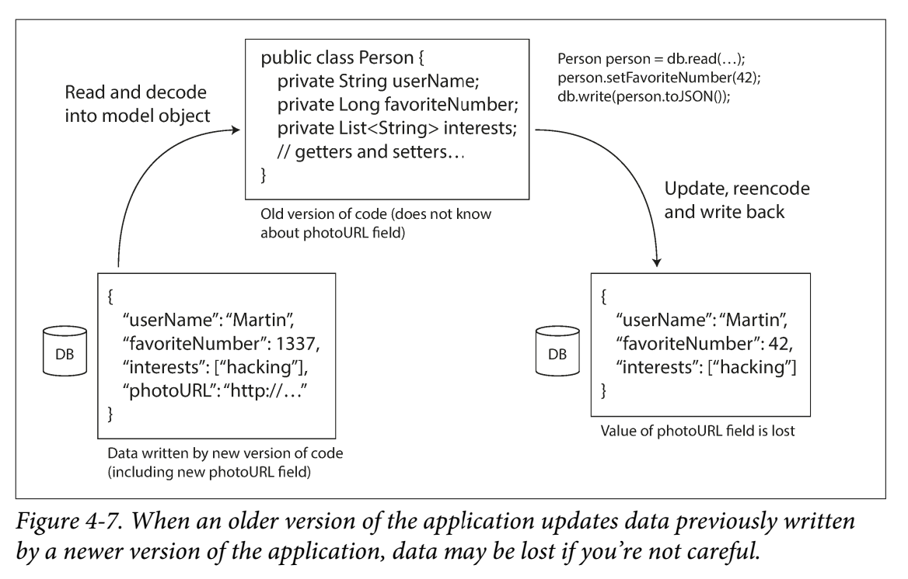

## Language-Specific한 인코딩 포맷

- 많은 프로그래밍 언어에서는 오브젝트를 byte로 인코딩하는 라이브러리 제공
- 사용이 편리하다는 장점이 있지만, 다음의 깊은 문제점 존재
  1. 여러 언어들간의 상호 호환성 문제
  2. 공격자가 악성코드를 바이트 코드로 인코딩하고, 어플리케이션에서 해당 바이트를 디코딩 할경우 악성코드가 실행될수 있다.
  3. 대부분 데이터 버저닝을 고려하지 않으므로, forward.backward compatibility 지원 불가능
  4. 인코딩,디코딩 과정의 효율성이 떨어진다.

## JSON/XML/CSV/Binary Variant

- XML은 데이터를 표현하는 구조가 매우 verbose하다는 단점이 있다.
- JSON은 XML에 비하면 구조가 단순하다는 장점이 있다.
- XML,CSV는 숫자타입과 문자열 타입을 구분하지 못하며, JSON은 Integer타입과 float 타입을 구분하지 못하며 precision또한 명세하지 못함.
- JSON과 XML은 Unicode 문자열 표현을 지원하지만,Binary 문자열은 표현하지 못함.
  - JSON에서는 이를 극복하기 위해서 Base64 방식으로 인코딩해서 이를 해결하기도 하지만, 이는 데이터 사이즈를 33%가량 증가시킨다는 단점이 있다.
- XML과 JSON에서 선택적으로 스키마 사용을 지원하지만, 복잡하고 구현하기 어렵다는 단점이 있다.
- CSV는 아예 스키마가 없고, escaping 규칙은 정의되어 있으나 newline문자는 명확하게 정의되지 않았다.

> JSON,XML,CSV는 잘 정의된 포맷이라고 보기는 어렵지만, 많은 사람들이 데이터 포맷으로  동의를 했다는 점에서 앞으로도 인기가 있을것이라고 함.

- JSON에 바이너리 인코딩을 녹여넨 포맷(대표적으로 MessagePack, BSON, BJSON 등)과 XML에 바이너리 인코딩을 녹여넨 포맷(WBXML,...)이 존재하지만, 널리 사용되고 있지는 않고 있고 스키마를 여전히 인코딩할때 포함시켜줘야 하는 단점이 있다.

- MessagePack 동작방식
  - 
    - 메타데이터 바이트에는 상위 4비트는 타입을 나타내고, 하위 4비트는 길이를 나타낸다.
    - 원래의 JSON 포맷크기인 81바이트에서 66바이트로 감소함을 확인할 수 있다.

## Thrift 와 Protocol Buffer

- Thrift와 Protocol Buffer는 유사한 interface definition language(IDL)형태를 보이고 있음.

  - Thrift
    - 

  - Protocol Buffer
    - 

- Thrift

  - 페이스북에 의해서 개발

  - BinaryProtocol과 CompactProtocol이라는 두가지 포맷 존재

    - BinaryProtocol

      

    - CompactProtocol

      

    - 위 두가지 경우에 필드들을 field name이 아닌 field tag로 구분하고 있으므로 바이트길이가 상당히 단축 되었음.

    - CompactProtocol의 경우, field tag와 field type을 하나의 바이트로 표현하고 숫자를 표현할때 8바이트를 다 사용하기 보다 필요한 양만 사용함으로써 바이트 길이를 더 단축시켰다.

- Protocol Buffers

  - 구글에 의해서 개발
  - 
  - 위의 Thrift CompactProtocol과 sign 비트의 위치 정도가 다르고 방식이 거의 동일하다.

- Thrift, Protocol Buffer의 Schema Evolution에 따른 Backward,forward compatibility

  - forward compatibility
    - 새로운 필드를 추가하는 경우, 구버전 코드에서 새로운 필드를 인식하지 못할뿐 문제될것이 없음. 
    - 필드를 삭제하는 경우에는 항상 optional 필드만 삭제가능
  - backward compatibility
    - forward compatibility의 반대로 생각하면 됨.
    - 새로운 필드 추가하는 경우에는 항상 optional 조건으로 정의해야함(그렇지 않으면, 구번전 코드가 생산한 데이터를 읽을때 문제 발생)
    - 필드를 삭제하는 것은 자유롭게 가능
  - Data type을 변경하는 경우에 고려사항
    - 최신버전 코드에서 해당 필드를 64비트로 인코딩 하도록 변경한뒤, 구버전 코드에서 특정 필드를 32비트 int변수에 할당하려고 하면 일부 비트가 잘려나가서 정확한 데이터로 읽을수 없을 수 있다.
    - Protocol Buffer에서는 optional 조건의 필드와 repeated 조건 필드를 서로 변경해도 필드를 여전히 읽을수 있다. repeated 조건으로 인코딩된 필드를 optional로 읽으면 리스트의 마지막 아이템으로 읽게 된다. optional 조건으로 인코딩된 필드를 repeated 조건으로 읽으면 값이 비어있을 경우 크기가 0인 리스트로 읽고 값이 존재할 경우 크기가 1인 리스트로 읽게 된다.
    - Thrift의 경우 전용 리스트 데이터 타입이 있지만, Protocol Buffer에서 제공하는 optional과 repeated 조건의 상호 호환성의 장점을 누릴수는 없다. 하지만 nested 리스트를 표현할수 있다는 장점이 있다.

## Avro

- 하둡의 하위 프로젝트로 2009년에 개발되기 시작

- 사람이 작성하기 쉬운 언어와 컴퓨터로 읽기쉬운 언어로 구성됨

  - 
  - 

- 아래처럼 Thrift와 Protocol Buffer와 달리 데이터 타입을 표시할 필요가 없어서 바이트 길이가 짧아짐

- writer schema와 reader schema는 protocol buffer,Thrift와 유사하게 달라도 호환가능. 

  - 필드 정의 순서가 달라도 상관없음.
  - writer schema와 reader schema를 나란히 두고 비교해서, 두 스키마의 차이를 분석
  - 데이터의 해당 필드가 없으면 디폴트 값으로 할당하고, 새로운 필드가 존재하면 무시함.

- Schema Evolution도 앞의 protocol buffer, thrift와 유사하게 동작

  - 디폴트 값이 설정된 필드만 추가(backward compatibility 보장) 또는 삭제 가능(forward compatibility 보장)

- Avro는 따로 required,optional 조건이 없음. 대신 union 필드와 디폴트 값이 있음.

- Writer schema는 어디에 정의되는가?

  - 많은 레코드를 하나의 거대한 파일에 저장하는 경우
    - 이 경우, 파일의 시작지점에 schema를 한번 정의해둔다.
  - 개별적으로 여러 버전의 스키마의 레코드를 디비에 저장하는 경우
    - 데이터 insert시점에 각각의 인코딩된 레코드의 시작 부분에 스키마 버전을 포함시킨다. 그리고 레코드를 읽을때 버전 number를 읽고 해당 스키마를 로드한후 데이터를 디코딩한다.(대표적으로 Espresso 디비가 이런식으로 동작한다)
  - 네트워크로 레코드를 보내는 경우
    - 커넥션을 맺을때 스키마 정보를 서로 합의한후, 커넥션 종료시점까지 해당 스키마로 데이터를 주고 받는다.

- Avro의 장점

  - 데이터의 압축률이 ProtocolBuffer, Thrift에 비해 좋다.

  - RDB의 테이블별로 레코드들을 파일로 기록하는 작업을 한다고 가정할때, Avro를 사용하면 테이블 스키마 변경이 일어날때 아무문제 없이 Avro 스키마를 동적으로 생성할수 있다. 반면, Thrift나 ProtocolBuffer를 사용하면, field tag를 생성할때 해당 tag를 사용할수 있는지 없는지 판단하기가 매우 어렵다. 

    - 예를들어, 3번째 칼럼이 삭제된 경우 새로운 스키마를 생성한다고 할때 해당 3번을 스킵해야 한다는 것을 주의해야만한다.
    - 반면 Avro는 이러한 부분을 신경쓸 필요가 없다.

  - Thrift와 Protocol Buffer는 code generation을 반드시 해야 사용이 가능하고 대부분의 언어에서 코드 생성을 해주는 라이브러리를 제공하고 있다. 이 경우 정적 타입언어를 사용하면 타입 체킹이나 자동완성을 IDE에서 지원해준다는 장점이 있다.

    - Python, Javascript와 같은 동적 타입 언어에서는 컴파일 스텝이 없어서 자동 코드 생성이 큰 장점이 없다고 함. 

      > 그런데 Pycharm과 같은 IDE가 굉장히 똑똑해졌기 때문에 정적 타입체킹이나 자동완성을 사용할수 있지 않을까? 물론 Pycharm과 같은 스마트한 IDE가 없었다면 런타임에 해당 타입 에러를 발견할수 있을테니 정적타입 언어에 비해 개발이 어려울것 같긴함.. 

  - Avro의 경우 자동 코드생성으로 사용해서 역직열화할수도 있고, 스키마파일이 있다면 해당 파일로 데이터를 역직열화할수 있다.

    - 대표적으로 Apache Pig에서 스키마 파일을 가지고 Avro 파일들을 읽고 쓴다고 함.

## 스키마의 장점

- ProtocolBuffer, Thrift, Avro는 JSON이나 XML 스키마에 비해 훨씬 심플하고 더 세부적인 validation 규칙들을 지원한다. 또한 데이터를 쓰거나 읽을때 구현하기고 쉽다.(코드 자동 생성으로 복잡한 데이터 파싱이 필요없어서 구현하기 쉬운듯)
- 많은 데이터 시스템들은 자체 바이너리 인코딩방식을 가지고 있고, 디코딩 할수 있도록 드라이버를 제공하고 있음.
- 장점
  1. 다양한 binary JSON variant들보다 더 짧은 바이트 길이를 갖는다.
  2. 스키마를 정의하면 데이터를 명확하게 문서화할수 있다는 장점이있음, 반드시 스키마를 로드해야 데이터를 읽을수 있으므로 스키마가 최신버전이라는것을 반강제적으로 확인할수 밖에 없음.
  3. forward,backward compatibility를 체크하기 용이함.
  4. 정적타입 언어에서 코드 생성을 통해서, 컴파일 타임에 타입을 체크하거나 IDE 상에서 자동완성을 지원함.
- 요약하면 데이터에 대한 더 상세한 제약사항을 명시할수 있고 개발을 용이하게 하는 툴과도 호환이 잘되며, 상위.하위 호환성과 같은 것도 제공할수 있으므로 유연하다.

## Dataflow 방식

데이터를 보내고 받는 대상에 있어서 좀더 구체적으로 유형을 분류하자면 3가지가 가능

- 디비를 통해서 통신
- REST나 GRPC와 같은 프로토콜을 통해서 통신
- 비동기 메시지 전달을 통해서 통신

### 디비를 통해서 통신하는 경우

- 여러 버전의 코드로 실행되고 있는 어플리케이션에 의해서 발생할수 있는 데이터 손실 사례
  - 
- 만약 DB에 스키마가 변경되는 경우, 이전 스키마로 적재된 데이터를 모두 새로운 스키마에 부합하도록 다시 업데이트 해야한다면 비용이 많이 든다.
  - 보통 RDB에서는 새로 칼럼이 추가된경우, 해당 칼럼값이 설정되지 않은 레코드들에게는 디폴트 값을 설정하도록 한다.(MySQL은 무식하게 전체 레코드들을 다시 쓴다고 함..)
  - LinkedIn의 문서디비인 Espresso의 경우 Avro 스키마를 사용하여 스키마가 변경되더라도, 데이터를 읽을때 추가된 칼럼 값이 설정이 안되어있더라도 디폴트 값으로 읽을수 있도록 한다.
- 데이터 복제나 백업을 위해서, 디비의 스냅샷을 취하는 경우에는 최신 데이터 스키마로 데이터를 기록하고 해당 스키마가 변경될 일은 없기때문에 Avro와 같은 포맷도 좋지만 Parquet 포맷도 좋은 선택이다.

### REST, RPC로 통신하는 경우

- 하나의 어플리케이션을 기능별로 여러 서비스로 나눈방식을 마이크로서비스 아키텍처(MSA)라고 함.
- 웹 서비스의 두가지 접근 방법
  - REST 
    - 프로토콜이라기 보다는 HTTP의 원칙에 기반한 디자인 철학
    - OpenAPI와 같은 포맷으로 RESTful API들을 명시하고 문서를 생성할 수 있다.
    - SOAP에 비해 간단하고 자동화된 툴링의 도움이 필요없음
  - SOAP
    - XML 기반의 프로토콜
    - HTTP와 독립적으로 동작
    - WSDL(Web Service Description Language)이라는 언어로 구현
    - 여러 기관에서 SOAP 구현체가 달라서, 상호호환이 잘안되는 경우가 있지만 여전히 큰 기업에서 사용되고 있다.
    - 툴과 코드생성 그리고 IDE에 의존하며 동적타입 언어에서 지원이 어렵다.
- RPC 모델은 remote 서비스에 있는 메소드를 마치 로컬 프로세스에 있는 메소드를 호출하는것처럼 하려고 노력하는데(Location transparency), 이러한 접근은 근본적으로 결함이 있다.
  - 네트워크 요청은 굉장히 많은 외부적인 변수에 영향을 받음.
  - 네트워크 요청에 대한 응답이 timeout된 경우, 실제 요청의 성공 여부를 알수 없음.
  - 네트워크 요청을 여러번 재시도 하는경우 멱등성을 보장하지 않을경우 중복해서 요청이 처리될수 있음.
  - 네트웤크 요청의 지연시간은 예측할 수 없음.
  - 네트워크 요청에 큰 오브젝트를 인코딩해야하는 경우 문제가 발생가능.
  - 데이터를 수신하는 측과 송신하는 측의 프로그래밍 언어가 다를경우, 타입 호환성 문제가 발생 가능.
    - ex. JavaScript에서는 2^53 보다 큰 수를 할당할 수 없음.
- RPC의 현재 동향
  - 바이너리 인코딩 기반의 RPC 프로토콜 등장
    - Thrift, Avro에서 RPC 지원추가
    - Protocol Buffer기반의 RPC 구현체 gRPC
  -  RPC 프로토콜이 REST에 비해 성능이 좋지만, RESTful API들은 테스트하고 디버깅하기 쉽다.
    - 대표적으로 웹 브라우저나 `curl` 커멘드라인 명령어를 사용할수 있다.
    - 주류 프로그래밍 언어와 플랫폼에서 지원하고 다양한 툴들이 REST 기반으로 지원이 되고 있다.
  - RPC는 주로 같은 조직 내의 서비스들간의 통신을 위한 수단으로 사용되고 있다.
  - 외부 클라이언트에게 공개된 RPC의 경우, API를 업데이트할때 기존의 API들은 호환성을 위해서 계속 유지해야 하는 문제점이 있다.
  - API 버저닝을 어떻게 해야할지에 대한 표준화된 동의가 없는 상태이다.

### Message-Passing 방식

- Message broker방식

  >  클라이언트와 서버가 직접 연결을 맺는 방식이 아닌, 메시지 브로커를 통해서 주고받는 방식

  - 수신자가 자신의 페이스대로 데이터를 처리가능
  - 메시지 재처리 가능
  - 송신자와 수신자가 서로 ip,port를 교환할 필요가 없음.(클라우드 가상머신에서 구동되는 경우 더욱더 유용함)
  - 하나의 메시지를 여러 수신자가 처리 가능
  - 송신자와 수신자를 decouple

- Distributed actor framework

  >액터 모델이란? 
  >
  >스레드들을 직접 다루는것이 아닌 액터라는 독립적인 로컬 상태를 갖고있는 클라이언트들 끼리의 메시지로 커뮤니케이션하는 프로그래밍 모델

  - actor 모델은 메시지의 유실을 고려하기 때문에 RPC 모델보다는 location transparency를 더 잘 지원한다.
  - actor framework
    - Akka
      - 기본적으로 Java의 built-in serialization 지원하지만, forward.backward compatible하지 않으므로 Protocol Buffer와 같은 인코딩 포맷으로 교체하면 rolling upgrade 가능
    - Orleans
      - rolling upgrade 불가능
      - Akka처럼 커스텀 직렬화 플러그인 지원
    - Earlang OTP
      - 스키마를 기록하기 힘듬
      - rolling upgrade는 가능하지만 주의해서 해야함.
