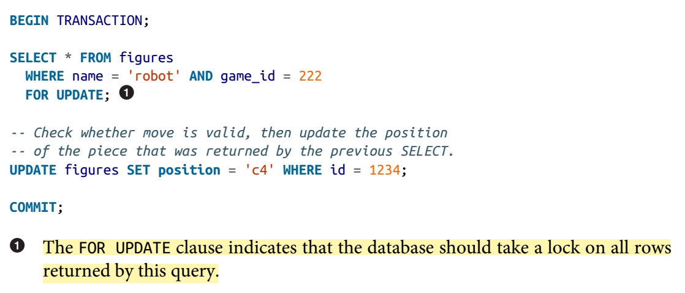
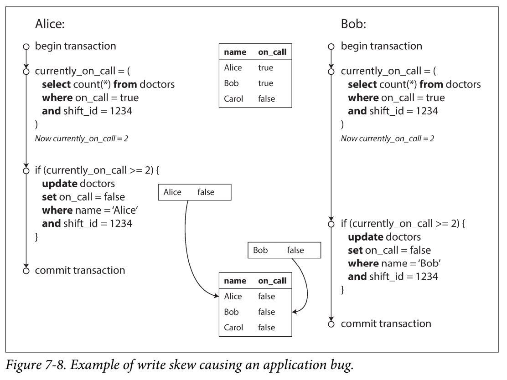
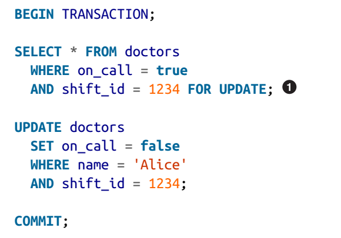
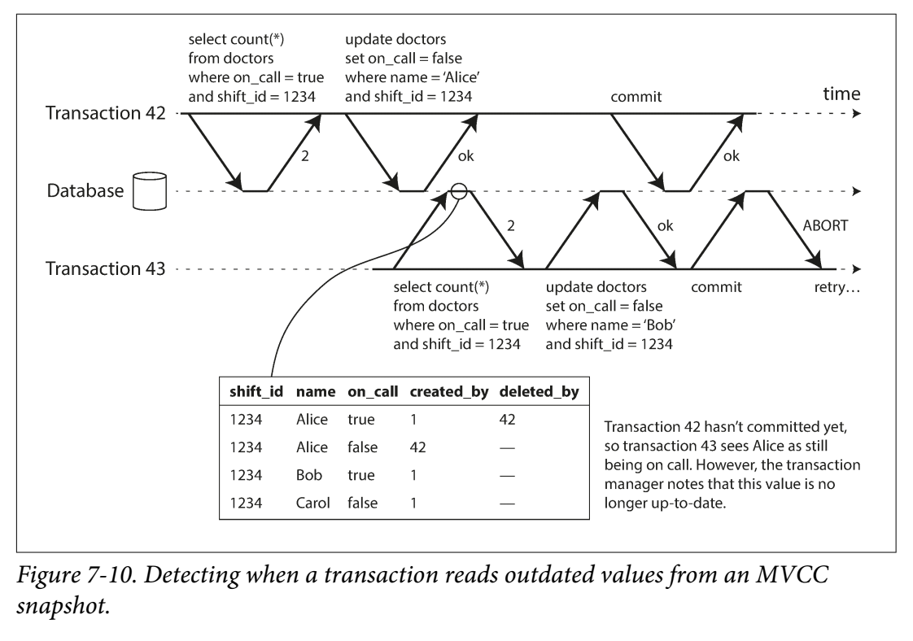
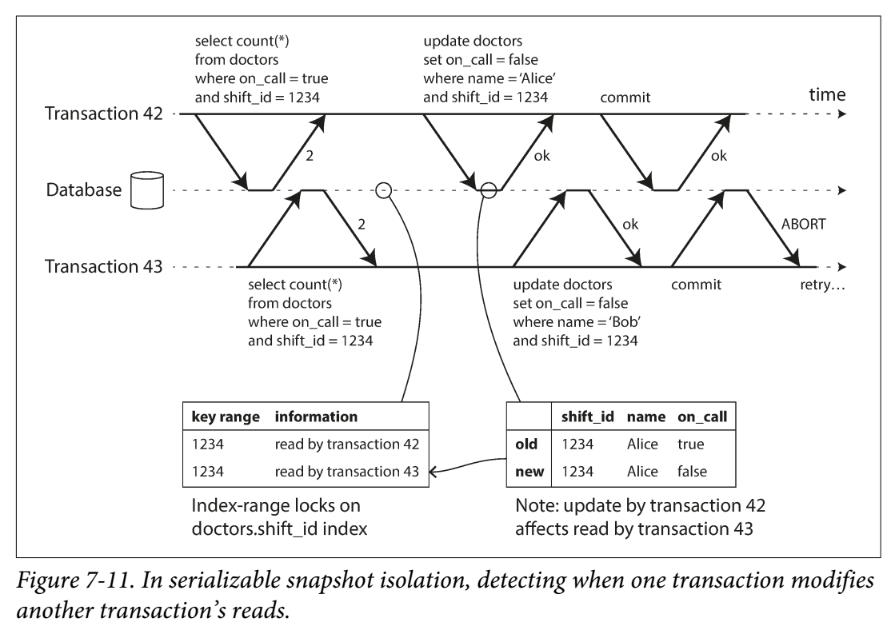

- 트랜젝션이란?

  - 여러 읽기,쓰기 작업을 하나의 작업으로 처리하기 위한 논리적 단위

- ACID 성질

  - 디비별로 ACID 구현방법이 같지 않으므로 상당히 모호하게 해석되고 있다.
  - Atomicity
    - 멀티스레드 프로그래밍에서 atomicity와는 전혀 다른의미
    - 트랜젝션에 에러가 발생했을때, 해당 트랜젝션으로 인한 쓰기작업을 모두 abort할수 있는가(all-or-nothing-guarantee)
    - abortability가 더 적절한 표현일수 있음.
  - Consistency
    - 디비에있는 데이터가 여러 불변조건(invariant)을 항상 만족하는 성질
    - 일반적으로 데이터가 valid한지 여부는 앱이 결정하므로 디비의 성질이라기 보다는 앱의 성질이다.
  - Isolation
    - 동시에 실행되는 트랜젝션들은 서로 격리되어야 한다는 성질
    - 많은 교과서에서 `serializability` 의미와 동일하게 정의 
      - `serializability` : 여러 트랜젝션이 동시에 실행되더라도, 마치 순서대로 실행된것과 같은 실행결과를 가져야 한다는 성질
      - 하지만 실제로는 serializable isolation은 퍼포먼스를 감소시켜서 잘 사용되지 않는다.
  - Durability
    - 트랜젝션이 성공적으로 커밋되면, 기록된 데이터는 영원히 보존되어야한다.
    - 이를 보장하기 위해서, 단일 노드 시스템에서는 데이터가 SSD,HDD에 저장되어야하고, 다중 노드 시스템에서는 데이터가 성공적으로 다른 노드에 복제될때까지 기다려야 한다.
    - 하지만 완벽하게 보장하는것은 불가능하다.(모든 백업이 파괴될수 있음)

- Isolation Level

  - Read Committed

    - 디비로부터 데이터를 읽을때, 오직 커밋된 데이터만 읽는다.(no Dirty Read)
    - 디비로 데이터를 쓸때, 커밋이 끝난 데이터에만 쓰기작업을 수행(no Dirty Write)
    - 구현방식
      - row-level 락 사용
        - row-level락을 사용해서 한번에 하나의 트랜젝션이 수정하도록 하여, dirty write를 방지.
        - 마찬가지로 레코드를 읽을때 해당 레코드에 락을 획득하여 다른 트랜젝션에서 수정이 되지 않도록 함.
        - 하지만 실제로는 읽기 트랜젝션이 쓰기 트렌젝션을 너무 오래 기다릴수 있기때문에 잘 사용되지 않는다.
      - 실제로는 row의 old value와 new value를 저장해서, 트랜젝션에서는 old value만 읽도록 구현이 된다. 데이터가 변경되고 commit까지 완료되면 new value가 old value로 치환된다.

  - Repeatable Read

    - non repeatable read(read skew) : 하나의 트랜젝션에서 같은 쿼리를 실행했을때 결과가 다르게 나오는 현상
      - 문제가 되는 2가지 상황
        - 전체 디비를 백업해야하는 작업을 하는경우, 백업은 특정시점을 그대로 백업해야되는데 데이터가 계속 변해서는 않됨
        - 분석쿼리나 integrity 검사를 해야하는 경우, 중도에 데이터가 변경되면 곤란하다.
    - non repeatable read가 발생하지 않도록 보장해주는 isolation level
    - Snapshot isolation으로 보통 해결하며, snapshot isolation이란 트랜젝션에서 시작시점에 커밋된 데이터만 읽도록하는 방법이다.
    - 오브젝트를 커밋된 버전별로 관리해서, 트랜젝션의 시작시점 기준으로 가장 최근에 커밋된 데이터를 일관되게 읽도록 한다. 이러한 기법을 MVCC(multi-version concurrency control)라고 한다.
      - PostgreSQL의 경우, 트랜젝션이 시작될때 유니크한 트랜젝션 아이디를 부여받고 데이터를 수정할때 해당 데이터에 트랜젝션 아이디를 태깅한다.
    - 보통 MVCC를 지원하는 디비에서는 READ COMMITTED ISOLATION을 구현하는데도 MVCC를 사용한다.
    - 멀티 버전 DB에서 인덱스를 구현하는 방법은 다음과 같은 방법이 있다.
      - 하나의 인덱스에서 오브젝트의 모든 버전을 가리키는 방법
      - 새로운 인덱스 엔트리를 기존의 인덱스 페이지에 기록하는것이 아닌, 루트에서 해당 페이지 까지를 복사해서 새로운 트리를 만들고 기록하는 방법
      - 쓰기작업을 할때마다 새로운 B트리 루트를 만드는 방법 (compaction과 가비지 컬렉션이 필요)
      - isolation level의 표준정의가 모호하기 때문에, 디비마다 repeatable read를 똑같은 형태로 구현하고 있지 않고 보장하는 항목들도 다 다르다.

    - Lost Update 발생상황

      - 여러 트랜젝션이 동시에 특정 레코드를 업데이트할때, 업데이트가 덮어써지는 현상으로, 주로 read-modify-write 사이클의 작업시 발생한다.

    - Lost Update 해결방법

      - Atomic write operation
        - 쓰기작업을 시작할때 exclusive lock을 얻고, 다른 트랜젝션이 쓰기작업이 끝날때까지 읽지 못하게 하는 방법
        - cursor stability라고도 부름
        - ORM 프레임워크에서 atomic write작업으로 자동 변환해주지 못하는 경우가 많으므로 주의해야 함.
      - Explicit locking
        - 디비에서 빌트인된 atomic 작업을 지원하지 않을때 사용하는 방법
        - 
        - `FOR UPDATE` 문을 사용하면 해당 쿼리에서 리턴되는 모든 행들에 락을 걸수 있음.
        - 어플리케이션 코드에서 명시적 락 설정부분을 빠뜨리지 않도록 주의해야함.
      - 디비단에서 자동으로 lost update 감지하기
        - 트랜젝션 매니저가 lost update를 감지하고 트랜젝션을 취소후 재시도하는 방법
        - 어플리케이션 코드단에서 작업할일이 없다는것이 장점
        - PostgreSQL의 repeatable read, Oracle의 serializable, SQL Server의 snapshot isolation level에서는 지원하나, MySQL InnoDB에서는 미지원
      - Compare-and-set
        - 마지막으로 읽은 데이터가 변하지 않았을때만 값을 변경하는 방법
        - 디비에서 old snapshot을 읽도록 허용하는 경우는 사용불가
      - 다중 노드 디비에서 컨플릭 해결방법
        - 위에서 소개한 locking 기법과 compare-and-set 방법은 데이터가 단일 노드에 존재한다는 가정하에 동작한다.
        - 동일 데이터가 여러노드에 존재할수 있는 replicated 디비의 경우, 각각의 노드에 동시적으로 쓰기 작업을 허용한후 어플리케이션 코드나 특수한 자료구조로 컨플릭을 해결한다.
        - 컨플릭 해결방법중 LWW(Last Write Wins) 방법은 lost update를 유발할수 있다.

    - Repeatable read level의 한계 : 모든 유형의 Write Skew를 해결할수는 없다.

      - 해결가능한 Write skew 발생상황

        

        - 두가지 트랜젝션이 동시에 다른 객체를 업데이트 한다는 점이 dirty write나 lost update와의 차이점

        - 여러 객체들을 대상으로 동시에 업데이트가 진행되기 때문에, atomic write나 디비단에서 자동으로 이를 감지하는 방식으로는 해결 불가
          - 해결방법
            - trigger나 materialized view를 사용해서 multi object에 대한 제약사항을 명시하는 방법
            - explicit locking 기법사용
              - 
            - unique 제약조건(가능한경우)
              - 여러 유저가 동시에 같은 유저네임으로 변경하려고 하는경우, 유저네임에 unique 제약조건 추가
              - 멀티플레이어 게임에서 여러 유저가 자신의 캐릭터를 같은 위치로 이동시키려고 하는 경우, 위치 필드에 unique 제약조건 추가

      - 해결 불가능한 Write Skew상황 

        > 아래 예시의 경우, select and insert 방식이기 때문에 explicit locking 기법을 사용할수 없다.(lock을 붙일 대상이 없으므로)

        - 숙박예약시스템에서 여러 유저가 겹치는 기간의 같은 방을 예약하는 경우
        - 뱅킹 시스템의 유저가 돈을 동시에 인출하려고 하는 경우, 인출기록을 동시에 DB에 삽입하게 됨으로써 잔고가 마이너스가 될수 있음

      - `phantom` : 하나의 트랜젝션의 쓰기 작업으로 다른 트랜젝션의 읽기 작업결과가 변경되는 현상

      - phantom을 동반한 Write Skew의 경우에 선택할수 있는 최후의 방법은 materializing conflict

        - 인위적으로 락 object를 디비에 도입해서, select and insert작업을 select and update방식으로 사용하도록 변경하는 방법
          - 인위적 락을 생성하는건 에러가 발생하기 쉽고, 어플리케이션 데이터 모델에 해당 메커니즘이 노출되기 때문에 못생긴 방법
          - 이보다는 Serializable isolation level을 사용하는것이 가장 좋다.

  - Serializability

    - Actual Serial Execution(실제로 순차적으로 실행되도록 하는 방법)
      - 싱글 스레드에서 트랜젝션을 실행하는 방법
      - 인러렉티브한 multi-statement 트랜젝션을 지원하지 않고, 스토어드 프로시져에서 전체 트랜젝션 코드를 한번에 실행한다.
      - 장점
        - 메모리에 데이터가 존재하는 경우, I/O 대기 시간이 줄어듬
        - 락을 coordination하는 비용이 없음.
      - 단점
        - 단일 CPU 코어로 스루풋이 제한됨
        - 메모리에 데이터가 없는 경우 성능이 매우 낮아진다.
        - 스토어드 프로시져를 사용하므로 다음의 단점이 있음.
          - 범용 프로그래밍 언어에 비해 라이브러리와 사용성이 부족하다.
          - 코드 버전관리, 테스트, 모니터링용 메트릭 수집이 어려움.
          - 코드를 잘작성하지 않으면 디비 성능에 악영향을 줌.
      - 하나의 트랜젝션에서 단일 파티션에 접근하도록 하면, CPU 코어당 트랜젝션 하나를 실행하게 해서 스루풋을 증가시킬수 있음.
      - 멀티 파티션 트랜젝션의 경우, 추가적인 coordination 비용이 발생하므로 성능이 떨어진다.
    - Two-Phase Locking(2PL)
      - Snapshot isolation과 달리, writer와 reader가 서로서로 block 할수 있음.
      - MySQL InnoDB, SQL Server의 serializable level, DB2의 repeatable read level에서 사용되고 있음.
      - 락을 획득하는 시점과 해제하는 시점이 나눠져있다고 해서 2PL이라고 부름.
      - 락 갯수가 많아짐으로 인해서 데드락이 발생할 확률도 높아지는데, 디비가 자동으로 이를 감지해서 일부 트랜젝션을 종료시킨다.
      - latency가 증가한다는 단점이 있고, 하나의 트랜젝션이라도 데이터를 읽고 커밋을 빨리 안하면 해당 데이터에 의존하는 다른 무수한 트랜젝션들이 멈출수 있다.
      - 구현방법
        - Predicate locks
          - 검색 조건에 부합하는 오브젝트들에게 거는 락
          - 아직 존재하지 않는 오브젝트들에 대해서도 락을 적용할수 있음.
        - Index-range locks
          - predicate lock은 성능이 좋지 않기 때문에, 인덱스의 값들을 대상으로 락을 거는 방법
          - predicate lock보다 오버헤드가 적음
          - range lock을 위한 인덱스가 존재하지 않으면, 전체 테이블을 대상으로 lock을 검.
    - Serializable Snapshot Isolation(SSI)
      - Serial Execution과 2PL은 pessimistic 메커니즘
        - 조금이라도 잘못될수 있으면, 안전해질때까지 기다림
      - SSI는 optimistic 메커니즘으로, 트랜젝션을 일단 실행하고나서 커밋시점에 문제가 생겼는지 검사
      - High Contention(같은 오브젝트에 접근하는 트랜젝션이 많은경우)일때는 성능이 떨어지지만, Contention이 너무 높지 않고 디비의 부하가 크지 않다면 pessimistic 메커니즘보다 성능이 더 좋다.
      - 쓰기 작업을 하기전에, 가정이 되는 쿼리의 결과가 변경되었는지 감지해서 커밋할지 여부를 결정하는데 다음의 두가지 상황을 고려함.
        - 레코드를 읽기전에, 다른 트랜젝션에 의해 변경되었는지 감지
          - 
          - 트랜젝션 메니저가 레코드가 변경되었다는것을 트래킹하고 있음.
          - 다른 트랜젝션이 값을 변경했다고 해서 무조건 현재 트랜젝션을 abort하는 것이 아니라, 다른 트랜젝션이 커밋할때까지 기다림.(불필요한 abort 방지)
        - 레코드를 읽은후, 다른 트렌젝션에 의해 변경되었는지 감지
          - 
          - 인덱스 레인지락과 비슷한 기법으로, 여러 트랜젝션이 레코드를 읽을때 이 정보를 index-range entry와 함께 어딘가 기록
          - 어느 하나의 트랜젝션이 쓰기 락을 걸기전에, 다른 트랜젝션의 커밋이 끝날때까지 블락되지는 않고, 단지 다른 트랜젝션에게 오래된 데이터를 읽고있을수 있음을 알려줌.
          - 최종적으로 어느하나의 트랜젝션이 커밋될때, 해당 데이터를 변경하는 다른 트렌젝션을 abort 시킴.
      - 2PL에 비해서, 다른 트랜젝션이 쥐고있는 락이 풀릴때까지 기다릴필요가 없다는 것이 장점.
      - serial execution에 비해서, 여러 머신,CPU 코어로 scale out가능
      - 쓰기작업을 수행하는 트랜젝션이 수행시간이 길어질수록 컨플릭,abort가 발생할 가능성이 높아지므로, 가급적 빠르게 실행되도록 하는것이 좋다.